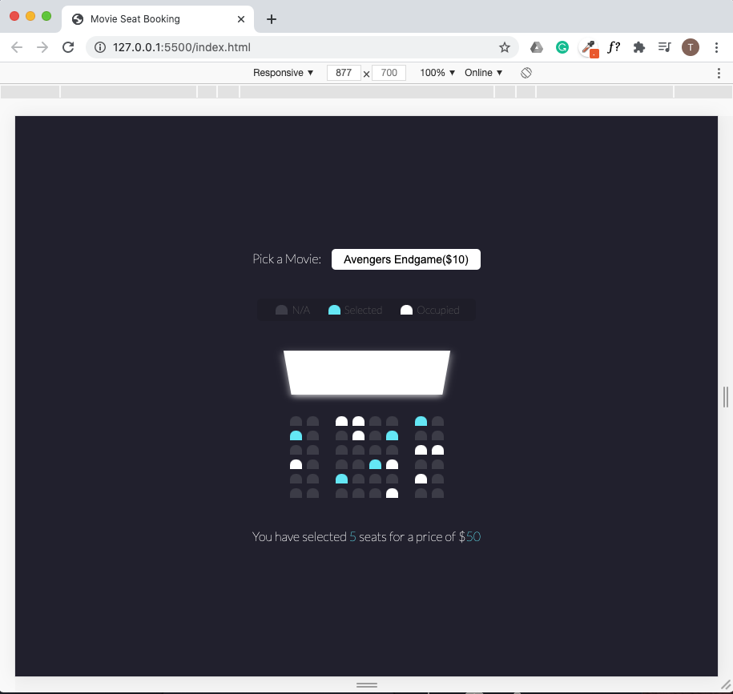

<h1 align="center"><strong>Movie Seat Booking App</strong></h1>

<h4 align="center"><em>Mini Javascript Project</em></h4>

----

<h4 align="center">Created: 12/18/2020</h4>
<h4 align="center">Last Updated: 12/18/2020</h4>

----
## Known Bugs

* n/a

## Support and contact details

* Name: Teresa Rosinski
  * GitHub:[TeresaRosinski](https://github.com/TeresaRosinski)
  * LinkedIn: [TeresaRosinski](https://www.linkedin.com/in/teresarosinski/)
  * Email: trosinski89@gmail.com

## Technologies Used

* Visual Studio Code
* Javascript
* HTML
* CSS

### License

Copyright (c) 2020 **_Teresa Rosinski_**

This software is licensed under the MIT license.